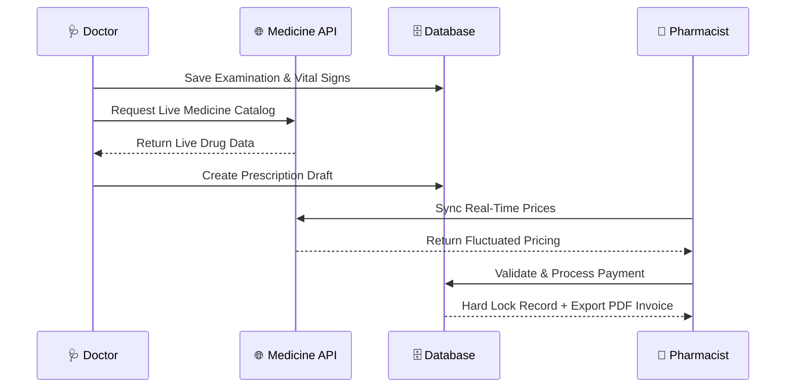
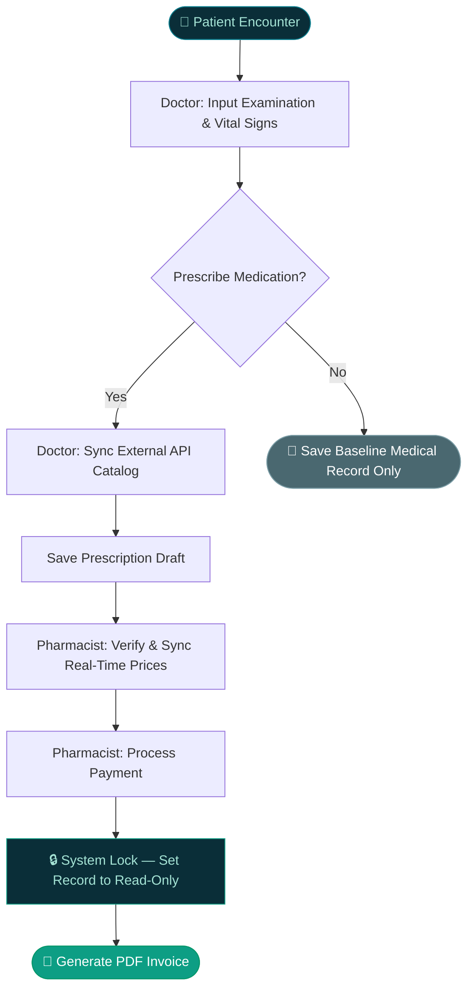

<div align="center">


<br/>

[](https://laravel.com)
[](https://php.net)
[](https://mysql.com)
[](https://alpinejs.dev)
[](https://tailwindcss.com)

<br/>

> **CS50SQL Final Project** — Harvard University  
> A high-performance electronic health record (EHR) system built on a fully relational schema,
> satisfying the database design and integrity standards of Harvard's CS50 SQL curriculum.

<br/>

[](https://cs50.harvard.edu/sql)
&nbsp;
[](.)
&nbsp;
[](LICENSE)

</div>

---

## 🏥 Overview

**SIMRS** *(Sistem Informasi Manajemen Rumah Sakit)* is a clinical medication prescribing interface connecting two roles — **Doctor** and **Pharmacist** — through a structured relational database pipeline.

The system manages the full lifecycle of a patient encounter: from examination and vital signs recording, to prescription drafting with live medicine API integration, through to pharmacy dispensing, payment processing, and automatic PDF invoice generation — with every mutation permanently logged in an immutable activity trail.

```
Patient Encounter → Doctor Examination → Prescription Draft
       → Pharmacist Validation → Payment → Hard Lock + PDF Invoice
```
---

## 📸 Screenshot

### 🔐 Welcome & Access
| Welcome Page | Authentication |
| :---: | :---: |
| <a href="https://github.com/user-attachments/assets/3a077659-d255-4939-9dfa-6e223c564c22"></a> | <a href="https://github.com/user-attachments/assets/a30d907e-c363-492f-929f-abacf8cc3f4b"></a> |

### 👨‍⚕️ Doctor Module
| Dashboard Overview | Patient Examination |
| :---: | :---: |
| <a href="https://github.com/user-attachments/assets/fe8cfebf-059f-4ca7-a214-3eaad07d76ab"></a> | <a href="https://github.com/user-attachments/assets/9572178e-6096-4a73-988c-cb91c8a0bb30"></a> |
| **Medication Selection** | **Activity Log** |
| <a ref="https://github.com/user-attachments/assets/0299ca0b-7648-4fb8-b4a2-a42ef5ecc40b"></a> | <a href="https://github.com/user-attachments/assets/f7f24a9d-71be-4276-86e0-2c26fd8f12fb"></a> |

### 💊 Pharmacist Module
| Dashboard Overview | Prescription Processing |
| :---: | :---: |
| <a href="https://github.com/user-attachments/assets/648477d1-d4b0-4634-a2f4-732de6d59878"></a> | <a href="https://github.com/user-attachments/assets/f1c0129f-e5ae-41ce-8ac3-97f2f404001e"></a> 

---

## 🔄 System Workflows

### Architectural Sequence



### Business Logic Flow


### Prescription Status Lifecycle

```
[pending] ──────► [calculated] ──────► [paid / locked]
    │                   │                      │
  Draft            Pharmacist              Hard Lock
  by Doctor        validates            PDF generated
                  & prices synced       record frozen
```

## 🚀 Installation

### Prerequisites

| Requirement | Version |
|---|---|
| PHP | ≥ 8.2 |
| Composer | ≥ 2.x |
| MySQL | ≥ 8.0 |
| Node.js | ≥ 18.x |

### Step 1 — Clone & Install Dependencies

```bash
git clone https://github.com/your-username/medication-prescribing-web-app.git
cd medication-prescribing-web-app.

composer install
```

### Step 2 — Environment Configuration

```bash
cp .env.example .env
php artisan key:generate
```

Update `.env` with your credentials:

```env
# ── Database ──────────────────────────────────
DB_CONNECTION=mysql
DB_HOST=127.0.0.1
DB_PORT=3306
DB_DATABASE=medication_prescribing-web-app
DB_USERNAME=root
DB_PASSWORD=

# ── Medicine API (External) ───────────────────
MEDICINE_API_BASE_URL=https://rxnav.nlm.nih.gov/REST
MEDICINE_API_EMAIL=dummy_email
MEDICINE_API_PASSWORD=dummy_password
MEDICINE_API_TOKEN_CACHE_KEY=medicine_api_bearer_token
```

### Step 3 — Database Migration & Seeding

```bash
php artisan migrate --seed
```

> **Note:** The seeder automatically generates **10 mock patients** via Factories and initializes default access accounts for both the Doctor and Pharmacist roles.

### Step 4 — Run Local Server

```bash
php artisan serve
```

Navigate to `http://localhost:8000` and log in with the seeded demo accounts:

| Role | Email | Password |
|---|---|---|
| 🩺 Doctor | `doctor@harvard.edu` | `password` |
| 💊 Pharmacist | `pharmacist@harvard.edu` | `password` |

---

## 🧩 Core Features

### 🩺 Doctor Module

<details>
<summary><strong>Examination Input</strong></summary>
<br/>

- **Smart Patient Selection** — patients sorted by most recent arrival for instant access
- **Examination Timestamp** — automated logging to track medicine pricing benchmarks at time of recording
- **Vital Signs Tracking** — complete input mapping: Height, Weight, Blood Pressure (Systole/Diastole), Heart Rate, Respiration Rate, Body Temperature
- **Clinical Notes** — free-text SOAP observation fields
- **Document Attachment** — optional upload for external lab or diagnostic files (PDF/Images)

</details>

<details>
<summary><strong>Prescription Management</strong></summary>
<br/>

- **Live API Integration** — real-time drug catalog lookup via external REST API endpoints
- **Medicine Search Widget** — Alpine.js powered live search replaces static dropdowns; filters across full catalog client-side
- **Signa Builder** — route, frequency, timing, and pharmacy notes per medicine item
- **Edit Access Control** — doctors can freely amend prescriptions until pharmacist processes payment
- **Backend Validation** — server-side guard layer preserving medical record integrity

</details>

<details>
<summary><strong>Activity Logging</strong></summary>
<br/>

- Every `CREATE`, `UPDATE`, and `DELETE` mutation is permanently written to `activity_logs`
- Stores before/after snapshots for UPDATED events
- Records IP address, user agent, and timestamp per entry
- Accessible from the Doctor dashboard under *Activity Log*

</details>

---

### 💊 Pharmacist Module

<details>
<summary><strong>Prescription Queue</strong></summary>
<br/>

- View all pending prescription drafts submitted by doctors
- Expandable drawer per row reveals itemized medicine list with quantities and subtotals
- Real-time status indicators: `Waiting` → `Verified` → `Dispensed`

</details>

<details>
<summary><strong>Validation & Payment Processing</strong></summary>
<br/>

- **Price Sync** — fetches active fluctuating medicine prices via medicine ID before calculating totals
- **Validate** — moves prescription from `pending` to `calculated`, locking itemized costs
- **Process Payment** — finalizes transaction and issues hard lock on the clinical record

</details>

<details>
<summary><strong>Finalization & Output</strong></summary>
<br/>

- **Hard Lock** — post-payment, medical record is set to `Read-Only`; doctor edit access is revoked
- **PDF Invoice** — standardized payment receipt exported in PDF format for patient records

</details>

---

## 🏆 Achievement

<div align="center">


<br/><br/>

**CS50 SQL — Harvard University**  
*Verified Certificate of Completion*

</div>

---

<div align="center">


<sub>
© 2026 SIMRS CS50 SQL Final Project &nbsp;·&nbsp; Developed by <strong>Imam Bastomi</strong> &nbsp;·&nbsp; <em>This is CS50.</em>
</sub>

</div>
