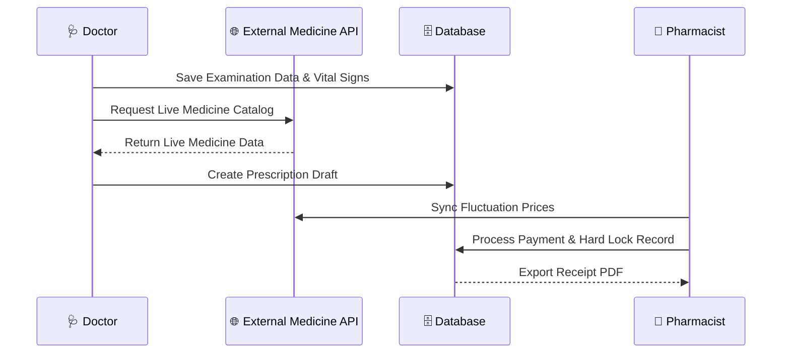
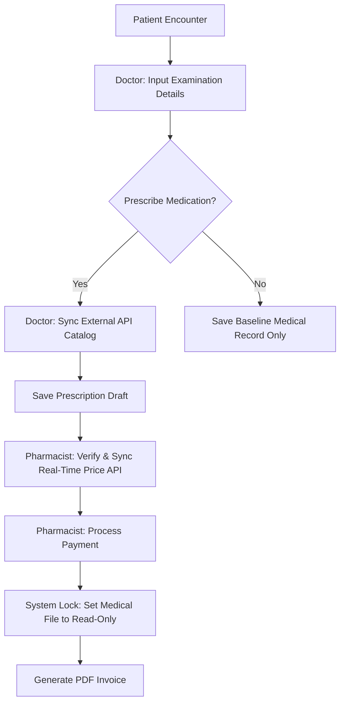

## 🎓 CS50SQL Project & Database Design

This application implements a secure electronic health record (EHR) environment built on a fully normalized relational schema, satisfying the database standards of Harvard's CS50SQL:

* **Schema Design & Integrity:** 3NF normalized relationships spanning Users, Patients, Examinations, Prescriptions, and Payments. Strict foreign key mapping (`ON DELETE RESTRICT/CASCADE`) prevents orphaned medical data.
* **Concurrency & Locking:** Employs programmatic atomic locks to secure clinical data post-payment, forcing a hard *Read-Only* state to guarantee permanent audit trails.
* **Optimization:** Strategic indexing applied across heavily queried composite keys and status attributes (`patient_id`, `doctor_id`, status flags) to optimize fetch speeds for dense patient charts.

---

---

## 🚀 Core Workflows & Features

Both modules feature secure session authentication powered by **Laravel Breeze** alongside server-side validation (`FormRequest`) to ensure data integrity.

### 🩺 Doctor Module
* **Clinical Records:** Document patient vital signs (BP, HR, RR, Temp, BMI), free-text clinical assessment notes, and optional physical file attachments.
* **Prescription Engine:** Real-time drug lookup powered by external API sync. Doctors retain open editing access **strictly until** the prescription gets fulfilled.
* **System Logging:** Every data mutation generates immutable security logs.

### 💊 Pharmacist Module
* **Fulfillment & Pricing:** Fetch pending doctor prescriptions and calculate live costs through external fluctuating medicine API endpoints.
* **Billing System:** Process payments, generate official **PDF** receipts, and instantly issue a global hard lock on the underlying medical files.

---

## 🔄 System Workflows

### 1. Architectural Sequence

### 2.Business Logic Flow

