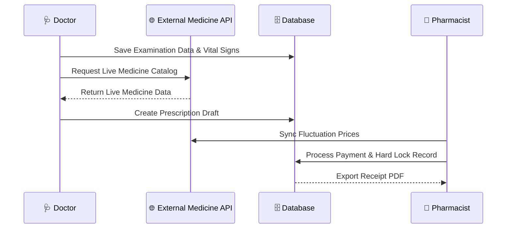
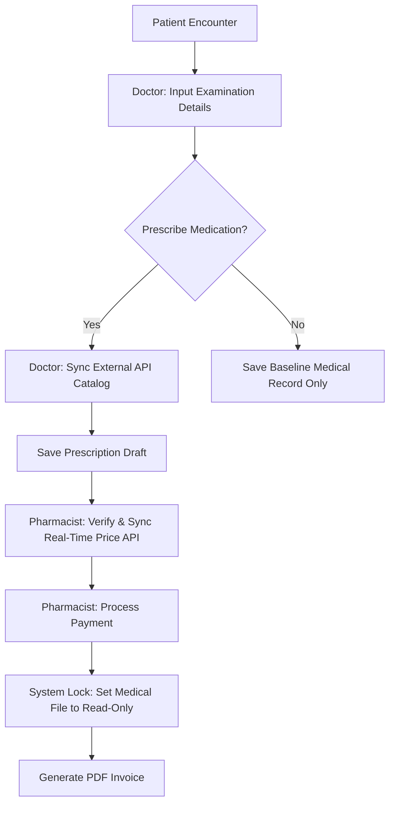

## 🎓 CS50SQL Project & Database Design

This application implements a secure electronic health record (EHR) environment built on a fully normalized relational schema, satisfying the database standards of Harvard's CS50SQL:

* **Schema Design & Integrity:** 3NF normalized relationships spanning Users, Patients, Examinations, Prescriptions, and Payments. Strict foreign key mapping (`ON DELETE RESTRICT/CASCADE`) prevents orphaned medical data.
* **Concurrency & Locking:** Employs programmatic atomic locks to secure clinical data post-payment, forcing a hard *Read-Only* state to guarantee permanent audit trails.
* **Optimization:** Strategic indexing applied across heavily queried composite keys and status attributes (`patient_id`, `doctor_id`, status flags) to optimize fetch speeds for dense patient charts.

---

---

## 🚀 Core Workflows & Features

### 🩺 Doctor Module
**Objective:** Document patient clinical outcomes and prescribing instructions.

**Key Features:**
* **Session Authentication:** Secure login powered by Laravel Breeze.
* **Examination Input:**
    * **Smart Selection:** Select patients from a pre-populated dropdown list.
    * **Examination Timestamp:** Automated logging to track fluctuating medicine pricing benchmarks.
    * **Vital Signs Tracking:** Complete input mapping: Height, Weight, Blood Pressure (Systole/Diastole), Heart Rate, Respiration Rate, and Body Temperature.
    * **Clinical Notes:** Free-text input fields for clinical observation findings.
    * **Document Attachment:** Optional uploads for external laboratory or diagnostic files (PDF/Images).
* **Add Prescription:**
    * **API Integration:** Live drug catalog lookup via external REST API endpoints.
    * **Edit Access:** Doctors can update the prescription freely until it has been processed or paid at the pharmacy.
    * **Backend Validation:** Server-side validation layer to preserve medical records integrity.
* **Activity Logging:** Every mutation made by a doctor or pharmacist is permanently written to an activity log.

---

### 💊 Pharmacist Module
**Objective:** Validate patient prescriptions and process administrative billing.

**Key Features:**
* **Session Authentication:** Secure login powered by Laravel Breeze.
* **Prescription Service:**
    * View medical drafts submitted by doctors and review itemized costs.
    * **API Price Sync:** Fetch active fluctuating medicine pricing tables live via the medicine ID.
* **Finalization & Locking:**
    * Process patient transaction payments.
    * Automatically issue a hard lock on the clinical record post-payment, restricting the doctor from making further structural changes.
* **Output:** Generate and export standardized payment invoices in **PDF** format.
---

## 🔄 System Workflows

### 1. Architectural Sequence

### 2.Business Logic Flow

## Achivement
!

